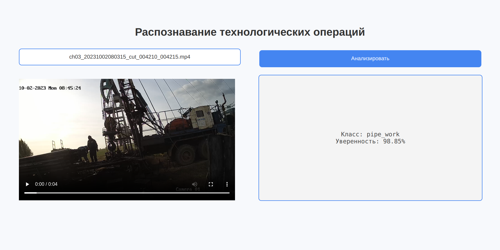

# Распознавание технологических операций

## Описание
Проект предназначен для автоматического распознавания технологических операций на нефтяной скважине компании Татнефть с использованием нейронных сетей. 
Цель – автоматизировать анализ технологических процессов и повысить эффективность работы.

## Превью




## Технологии
- Нейронные сети (VideoTransformer)
- Python
- PyTorch
- OpenCV
- NumPy

## Установка
1. Клонируйте репозиторий:

   ```sh
   git clone https://github.com/Anakhsup/The-Video-Operation-Recognition-Project
   ```
   
2. Перейдите в папку проекта:
   
   ```sh
   cd The-Video-Operation-Recognition-Project
   ```
   
3. Установите зависимости:
   
   ```sh
   pip install -e .
   ```
   

## Запуск
Запустите основной скрипт для распознавания операций:

   ```sh
	uvicorn app:app --reload
   ```
Затем открой в браузере: http://127.0.0.1:8000/

Загрузите свое видео для распознавания и нажмите кнопку "Анализировать".

## Структура проекта

   ```sh
    .
    ├── app.py                # Точка входа FastAPI
    ├── model/
    │   └── model.py          # Функция predict_video()
    │   └── weights.pth       # Веса модели
    ├── static/
    │   ├── style.css         # Стили
    │   └── preview.png       # Скриншот интерфейса
    ├── templates/
    │   └── index.html        # HTML-шаблон
    └── pyproject.toml
   ```

## Метрики качества
- Pricision - 0.9281
- Recall - 0.92
- F1 - 0.9178


## Данные
Проект использует датасет технологических процессов и операций.

## Авторы
- Арина Глущенко - Lead 
- Пучков Владислав - Ml
- Анастасия Калугина - MLOPs

## Лицензия

